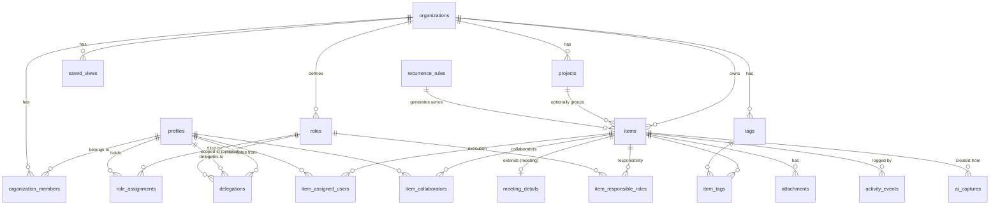

# Technical Document 1 — Entity Relationship Diagram (ERD)

> Status: **DRAFT — for review with the Database Design and TDL.** No SQL, no
> migrations yet. This is the conceptual + logical data model for the MVP,
> designed to absorb the approved product decisions without later redesign.
> Companion: `02-database-design.md`, `03-technical-decision-log.md`.

---

## 1. Design goals this model must satisfy

- **Multi-tenant** with hard isolation (`organization_id` on every business row → RLS).
- **Hybrid assignment:** an Item can have **many Responsible Roles** (one Primary)
  and **many Assigned Users** (one Primary), plus Collaborators.
- **Role→person indirection:** responsibility resolves through **time-bounded
  role assignments**, so staff changes are one-row operations.
- **Immutable history:** ownership/lifecycle changes are append-only events.
- **Calendar-ready Meetings**, **recurrence**, and **attachments** modeled now
  (some UIs deferred) so no redesign later.
- **Progressive disclosure** is a UI concern — the schema is identical for solo
  and team; an Organization always exists.

---

## 2. Entities at a glance

| # | Entity | Purpose | MVP UI? |
| --- | --- | --- | --- |
| 1 | `profiles` | App-side user record (mirrors Supabase `auth.users`) | ✅ |
| 2 | `organizations` | Tenant boundary | ✅ (hidden for solo) |
| 3 | `organization_members` | Membership + platform permission (owner/admin/member) | ✅ |
| 4 | `roles` | Durable business responsibilities ("Finance Manager") | ✅ (team) |
| 5 | `role_assignments` | Time-bounded user↔role (the indirection layer) | ✅ (team) |
| 6 | `projects` | Optional flat grouping of items | ✅ |
| 7 | `items` | The unit of work (Task / Note / Meeting) | ✅ |
| 8 | `meeting_details` | Meeting-specific fields (1:1 with meeting items) | ✅ (light) |
| 9 | `tags` | Flat labels | ✅ |
| 10 | `item_tags` | Item↔tag (M:N) | ✅ |
| 11 | `item_responsible_roles` | Item↔role responsibility (multi, one Primary) | ✅ |
| 12 | `item_assigned_users` | Item↔user execution (multi, one Primary) | ✅ |
| 13 | `item_collaborators` | Optional item↔user collaborators | ✅ |
| 14 | `recurrence_rules` | RRULE-based recurrence for a series | schema; UI if simple |
| 15 | `attachments` | Files on items (Supabase Storage) | schema now, UI later |
| 16 | `activity_events` | Append-only audit/activity log | ✅ (writes; history UI later) |
| 17 | `delegations` | Temporary, non-owning authority grants | schema now, UI later |
| 18 | `saved_views` | System + custom saved filters | ✅ |
| 19 | `ai_captures` | Raw capture + AI classification result (metrics/learning) | ✅ (internal) |

---

## 3. Diagram

---

## 4. Key relationships & cardinality (the load-bearing ones)

**Responsibility vs Execution (the differentiator).**
- `items` → `item_responsible_roles` → `roles` : an Item has **0..N** responsible
  roles; **at most one** flagged `is_primary`. (0 allowed because capture never
  forces a role — PDL-021.)
- `items` → `item_assigned_users` → `profiles` : an Item has **0..N** assigned
  users; at most one `is_primary`.
- "Who is responsible *now*" for a role is **derived**: `role` →
  `role_assignments` where `now` ∈ [`valid_from`,`valid_to`) → `profiles`.
- Hybrid = both responsible roles and assigned users present. Role-only = roles
  but no assigned users (derive people from the role). User-only = assigned users
  but no roles.

**Role assignment over time.**
- `roles` → `role_assignments` → `profiles` : many-to-many **through time**.
  `valid_to = NULL` means current. Replacement = close one row, open another;
  **no item rows change.**

**Item grouping.**
- `projects` → `items` : an Item has **0..1** project (optional). No folders/lists.
- `items` ↔ `tags` via `item_tags` : **M:N** (the real organizing axis).

**Meetings.**
- `items` → `meeting_details` : **1:0..1** — only when `items.type = 'meeting'`.
  Keeps the Item table clean and calendar-integration-ready.

**Recurrence.**
- `recurrence_rules` → `items` : one rule generates **0..N** occurrence items,
  linked by `items.series_id`. The rule holds the RRULE, timezone, next-run.

**Audit.**
- `activity_events` : append-only; references `item_id` (nullable for org-level
  events) and `actor_id`. Never updated or deleted.

**Delegation.**
- `delegations` : `from_user` grants `to_user` the right to *act* for a `role`
  (or specific `item`) during a window. Non-owning, non-cascading (PDL-017).

---

## 5. Enumerations (proposed)

- `item_type`: `task` · `note` · `meeting`
- `item_state`: `captured` (displayed as **"To Do"** — PDL-037; this line said
  "Inbox", which collided with the Inbox *view*) · `committed` · `in_progress` ·
  `done` · `snoozed` · `backlog`
- `priority`: `none` · `low` · `medium` · `high` · `urgent`
- `org_member_role` (platform permission): `owner` · `admin` · `member`
- `activity_event_type`: `created` · `state_changed` · `responsible_role_added` ·
  `responsible_role_removed` · `primary_role_changed` · `assigned_user_added` ·
  `assigned_user_removed` · `primary_user_changed` · `delegated` ·
  `delegation_ended` · `completed` · `tag_added` · `tag_removed` · `moved_project`

Enums are stored so they're extensible (adding a value must not require code
branching — PDL-007/028 spirit).

---

## 6. Cross-cutting columns (on every business table)

- `id uuid` (PK), `organization_id uuid` (FK → organizations, **RLS anchor**),
  `created_at`, `updated_at`, and where relevant `created_by` (→ profiles).
- Soft-deletion (`deleted_at`/`is_active`) on entities that must preserve history
  (`roles`, `profiles`-links, `items`), rather than hard deletes.

*(Column-level detail, constraints, indexes, and RLS policies are specified in
`02-database-design.md`.)*
